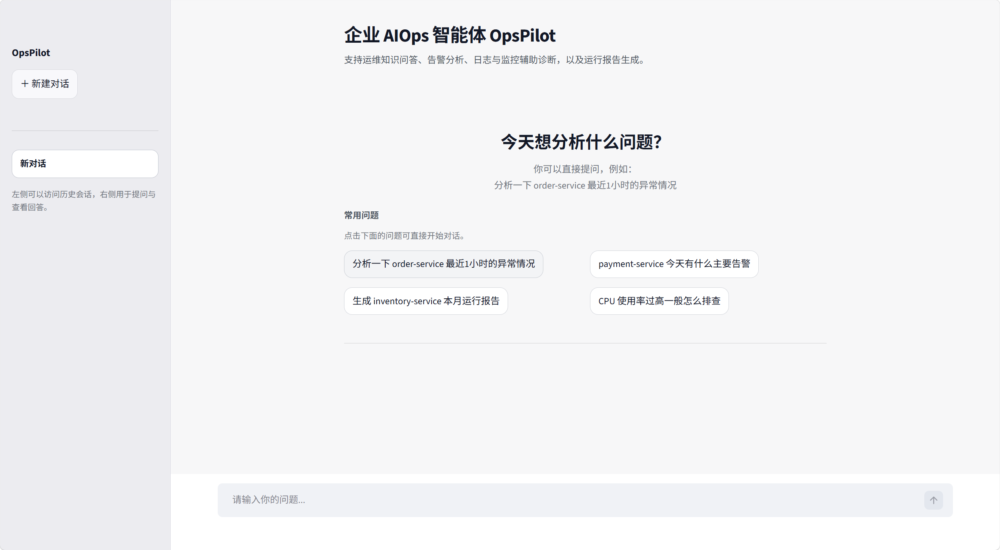
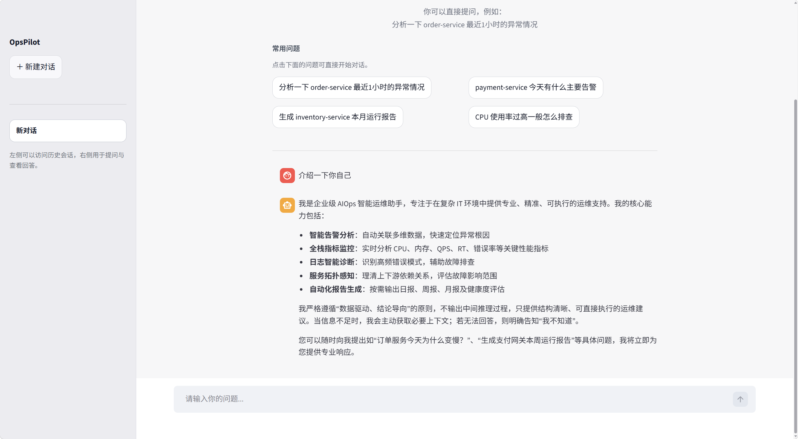
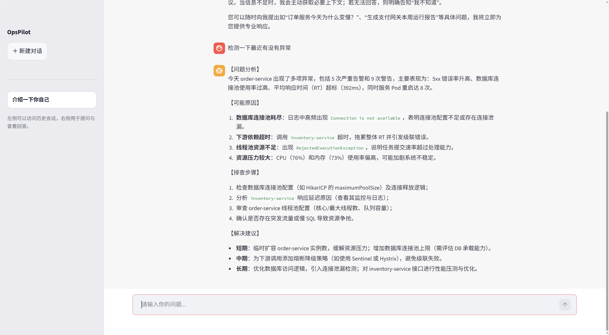

# 🚀 LangChain ReAct Agent 企业 AIOps 运维智能体

基于 **LangChain + ReAct Agent + RAG + Tool Calling** 构建的企业 AIOps 智能运维项目，面向服务异常分析、日志辅助诊断、监控指标解读、依赖关系梳理与运行报告生成等场景。

当前项目已经从早期的“问答示例”演进为 **AIOps 运维分析 Agent**：主提示词与报告提示词均围绕企业运维场景设计，工具层提供告警、指标、日志、拓扑与报告聚合能力，支持对 `order-service`、`payment-service`、`inventory-service` 等服务进行分析。

## 效果预览

### 1. 聊天界面展示
- 展示用户在前端输入问题后，系统返回问答结果的整体效果。左侧是历史记录



### 2. Agent 工具调用过程
- 展示 Agent 在任务处理中调用外部工具或执行中间推理的过程。
  


### 3. 报告生成示例
- 展示系统根据用户数据生成个性化分析报告的结果页面。




---

## 1. 项目定位

本项目的目标不是做一个通用聊天机器人，而是构建一个具备 **运维分析能力** 的智能体系统，让模型能够：

- 理解用户的运维问题
- 在必要时自动调用工具获取结构化数据
- 结合知识库完成补充分析
- 在普通问答与报告生成之间自动切换提示词
- 输出专业、简洁、可执行的运维结论

从当前主提示词可以看出，系统已经明确面向以下任务：运维知识问答、告警分析、监控指标分析、日志辅助诊断、根因推测与运行报告生成。

---

## 2. 核心能力

### 2.1 ReAct Agent 多工具协同

项目使用 `create_agent(...)` 构建 ReAct 智能体，统一注册 RAG、服务识别、时间范围识别、告警查询、指标查询、日志摘要、拓扑查询和报告聚合等工具，使模型可以根据任务自动选择调用路径。

### 2.2 RAG 检索增强

项目通过 `Chroma` 构建本地向量库，支持从 `txt / pdf` 文档中加载知识，并通过 `RagSummarizeService` 完成“检索 + 总结”式问答，适合承载 SOP、排障经验、系统说明等运维资料。

### 2.3 动态提示词切换

项目通过中间件在普通问答与报告模式之间切换：

- 普通场景：使用 AIOps 运维助手提示词
- 报告场景：使用结构化报告生成提示词

这让同一个 Agent 同时具备“即时分析”和“正式报告输出”两种能力。

### 2.4 面向运维的结构化工具集

当前工具层已包含：

- `fetch_alert_data`：告警信息
- `fetch_metric_data`：监控指标
- `fetch_log_summary`：日志摘要与高频错误
- `fetch_service_topology`：上下游依赖与中间件拓扑
- `fetch_report_data`：运行报告数据聚合
- `fill_context_for_report`：报告上下文注入

### 2.5 可扩展的数据接入方式

当前仓库内使用的是 mock 数据，便于快速演示 Agent 工作流；同时代码中也预留了后续接入真实系统的扩展位置，可进一步对接 Prometheus、Elasticsearch、告警平台、CMDB 或服务拓扑平台。

---

## 3. 适用场景

本项目适合以下典型场景：

- 分析某个服务最近 1 小时 / 24 小时的异常情况
- 结合告警、指标、日志进行初步根因推测
- 输出服务运行日报 / 周报 / 月报
- 基于知识库回答运维 SOP 与常见故障处理问题
- 对系统上下游依赖关系进行影响面分析

示例问题：

```text
分析一下 order-service 最近1小时的异常情况
生成 inventory-service 本月运行报告
payment-service 今天有哪些高频异常
order-service 的问题可能会影响哪些下游服务
```

---

## 4. 项目架构

```bash
.
├── agent/                       # Agent 核心逻辑
│   ├── react_agent.py           # ReAct Agent 主入口
│   └── tools/
│       ├── agent_tools.py       # 工具定义：告警 / 指标 / 日志 / 拓扑 / 报告 / RAG
│       └── middleware.py        # 中间件：工具监控、日志、动态提示词切换
├── config/                      # YAML 配置
│   ├── agent.yml
│   ├── chroma.yml
│   ├── prompts.yml
│   └── rag.yml
├── data/                        # 知识库文档目录
├── model/
│   └── factory.py               # 聊天模型与嵌入模型工厂
├── prompts/
│   ├── main_prompt.txt          # 普通问答提示词
│   ├── report_prompt.txt        # 报告模式提示词
│   └── rag_summarize.txt        # RAG 总结提示词
├── rag/
│   ├── rag_service.py           # 检索总结服务
│   └── vector_store.py          # 向量库加载与检索
├── utils/
│   ├── config_handler.py        # 配置读取
│   ├── file_handler.py          # 文件加载与 MD5 去重辅助
│   ├── logger_handler.py        # 日志模块
│   ├── path_tool.py             # 路径工具
│   └── prompt_loader.py         # 提示词加载器
├── app.py                       # 交互入口
├── requirements.txt
└── README.md
```

---

## 5. 工作流程

### 5.1 普通分析流程

1. 用户输入服务分析问题
2. Agent 解析是否已包含服务名与时间范围
3. 如信息不足，则调用 `get_target_service` / `get_time_range`
4. 调用告警、指标、日志、拓扑等工具补充上下文
5. 根据主提示词输出结构化分析结果

建议输出结构通常包括：

- 问题分析
- 可能原因
- 排查步骤
- 解决建议

### 5.2 报告生成流程

当用户请求“生成报告 / 今日运行情况 / 本周分析 / 本月分析 / 系统健康度分析”等内容时，Agent 会进入报告模式：

1. 必要时补全服务名与时间范围
2. 先调用 `fill_context_for_report`
3. 优先调用 `fetch_report_data`
4. 如数据不足，再补充调用告警 / 指标 / 日志 / 拓扑 / RAG 工具
5. 按报告提示词输出正式结构化报告

报告结构包括：

- 报告概览
- 核心指标表现
- 告警与异常情况
- 日志与根因分析
- 依赖与影响分析
- 综合判断
- 运维建议

---

## 6. 技术栈

- **Agent 框架**：LangChain、LangGraph
- **模型接入**：Tongyi / DashScope
- **向量数据库**：Chroma
- **文档处理**：PyPDFLoader、TextLoader
- **文本切分**：RecursiveCharacterTextSplitter
- **工程能力**：YAML 配置管理、日志系统、模块化结构设计

---

## 7. 当前项目中的关键设计

### 7.1 主提示词与报告提示词分离

项目将普通问答与报告生成拆成两套提示词：

- `main_prompt.txt`：聚焦 AIOps 分析、异常排查、工具调用规范
- `report_prompt.txt`：聚焦正式报告生成、章节结构与语言风格约束

这样可以避免“问答场景写成报告”或“报告场景写成闲聊回复”的问题。

### 7.2 知识库加载支持去重

向量库加载逻辑会对知识文件计算 MD5，并记录已处理文件，避免重复导入同一批资料。

### 7.3 模拟数据与真实接入解耦

当前仓库中的告警、指标、日志和拓扑数据使用 mock 数据，便于快速演示；后续只需要替换工具内部的数据获取逻辑，无需改动 Agent 主体流程。

---

## 8. 关于“流式输出”的建议

如果你使用的是 **Tongyi + Tool Calling + Agent 流式** 组合，需要注意兼容性问题。实践中更稳的方式通常是：

### 方案 A：推荐

- Agent 主流程使用非流式调用
- 拿到完整结果后，在应用层分段输出
- 对前端或控制台来说，仍然是“流式展示”

这种方式最稳，尤其适合带工具调用的复杂 Agent。

### 方案 B：两阶段流式

- 第一阶段：Agent 非流式完成工具调用与数据聚合
- 第二阶段：使用纯文本流式模型，对最终结果进行流式生成

如果你当前已经遇到 `KeyError: 'name'` 一类与流式工具调用相关的问题，优先建议采用 **方案 A**。

---

## 9. 快速开始

### 9.1 环境要求

- Python 3.10+
- 可用的 DashScope / Tongyi API Key
- 已安装并可正常使用的依赖环境

### 9.2 安装依赖

```bash
git clone https://github.com/lhh737/LangChain-ReAct-Agent.git
cd LangChain-ReAct-Agent
pip install -r requirements.txt -i https://pypi.tuna.tsinghua.edu.cn/simple
```

### 9.3 配置 API Key

Linux / macOS：

```bash
export DASHSCOPE_API_KEY="your-api-key"
```

Windows PowerShell：

```powershell
$env:DASHSCOPE_API_KEY="your-api-key"
```

Windows CMD：

```cmd
set DASHSCOPE_API_KEY=your-api-key
```

### 9.4 检查配置文件

首次运行前建议确认：

- `config/rag.yml`
- `config/chroma.yml`
- `config/prompts.yml`
- `config/agent.yml`

其中需要特别关注：

- 模型名称
- 向量库存储目录
- 知识库数据目录
- 提示词文件路径

### 9.5 准备知识库文档

将你的运维文档、SOP、系统说明、故障案例等放入 `data/` 目录，支持 `txt / pdf` 等文件类型。

### 9.6 初始化向量库

如果项目尚未完成知识库入库，可先执行相应加载逻辑，将 `data/` 中的资料写入 Chroma。

### 9.7 启动项目

根据你的 `app.py` 实现方式启动入口程序，例如：

```bash
python app.py
```

如果你的本地入口仍然是 Streamlit，则使用：

```bash
streamlit run app.py
```

---

## 10. 最小化验证

启动后可优先测试以下输入：

### 普通分析

```text
分析一下 order-service 最近1小时的异常情况
```

```text
payment-service 今天有哪些异常
```

### 报告生成

```text
生成 inventory-service 本月运行报告
```

```text
请给我一份 order-service 今日系统健康度分析
```

如果以上问题能够返回结构化结果，说明基础链路已经跑通。

---

## 11. 后续可扩展方向

可以继续把这个项目往更真实的企业 AIOps 方向扩展：

- 接入 Prometheus 获取实时指标
- 接入 Elasticsearch / Loki 获取真实日志摘要
- 接入告警平台实现实时告警分析
- 接入服务拓扑平台或 CMDB
- 支持多服务联合分析与影响扩散判断
- 支持工单生成、故障升级、自动化修复建议
- 增加 FastAPI / Web 前端 / Streamlit 可视化界面

---

## 12. 常见问题

### Q1：为什么建议不要直接打开 Agent 原生流式？

因为带工具调用的流式链路在部分模型接入下兼容性不稳定，容易在工具调用增量解析阶段报错。对当前项目而言，更稳的选择是“非流式执行 + 应用层伪流式输出”。

### Q2：当前数据为什么看起来是固定的？

因为当前工具层使用 mock 数据做演示，这是为了先把 Agent 工作流跑通。后续只需要替换工具内部的数据来源即可对接真实系统。

---

## 13. 致谢

- LangChain
- LangGraph
- Chroma
- Alibaba Cloud DashScope / Tongyi

---

## 14. License

本项目适合作为 Agent / AIOps / RAG / Tool Calling 学习与实践项目使用。

如果这个项目对你有帮助，欢迎点个 Star。
